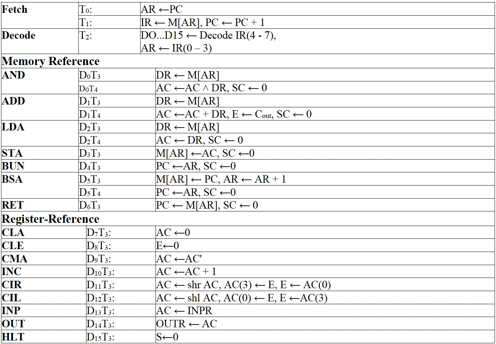

# Basic Computer Design using Logisim BLM320

## Project Overview

This project involves designing a basic computer using the Logisim program. The computer is capable of executing a set of instructions as specified in the project requirements. The main focus is on the hardware design aspects of the computer, including registers, memory, and the instruction set.

## Examples

- Addition (4+3)
  
- Subtraction (5-2)
  

## Components

### Memory

- **Size**: 16x8 bit

### Registers

- **Address Register (AR)**: 4 Bit
- **Program Counter (PC)**: 4 Bit
- **Data Register (DR)**: 4 Bit
- **Accumulator (AC)**: 4 Bit
- **Input Register (INPR)**: 4 Bit
- **Output Register (OUTR)**: 4 Bit
- **Instruction Register (IR)**: 8 Bit

## Instruction Set

### Memory Reference

- [Memory Reference](readme/Memory_Reference.pdf)

## Logisim Design

### Steps to Create the Design

1. **Create Registers**: Define the registers AR, PC, DR, AC, INPR, OUTR, and IR with their specified bit sizes.
2. **Memory Setup**: Create a 16x8 bit memory module.
3. **Instruction Implementation**: Implement the instruction set according to the provided instruction cycles.
4. **Control Logic**: Design the control logic to handle the fetch, decode, and execute cycles.
5. **Testing**: Simulate the design to ensure all instructions execute correctly.

## Getting Started

1. **Install Logisim**: Download and install Logisim from [Logisim's official website](http://www.cburch.com/logisim/).
2. **Load the Project**: Open Logisim and load the provided project file.
3. **Simulation**: Use the simulation tools in Logisim to test the computer design. Verify the execution of each instruction from the instruction set.

## Conclusion

This project demonstrates the fundamental concepts of computer architecture and hardware design using Logisim. By completing this project, you will gain hands-on experience with the design and simulation of a basic computer, understanding the intricate details of instruction execution and control logic.

## References

- [Project Documentation (PDF)](readme/LAB_PROJESI.pdf)
- Course Material for BLM320 - Bilgisayar Mimarisi (Computer Architecture)
